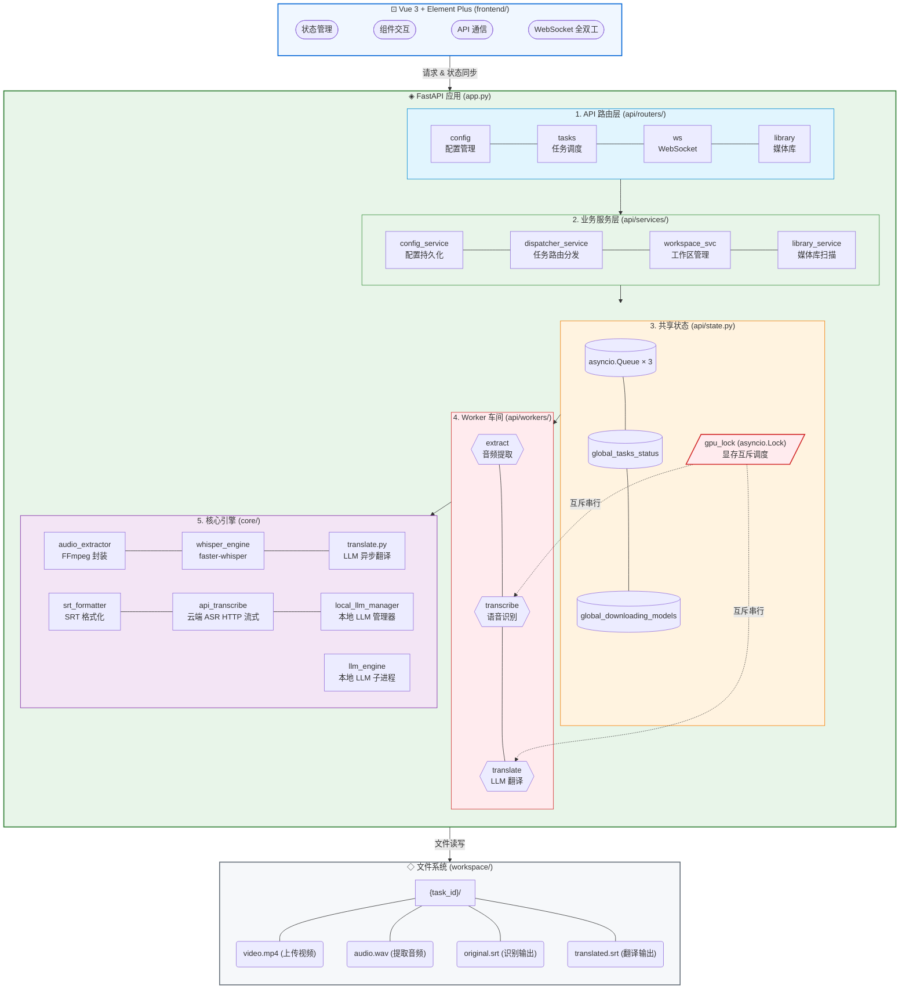
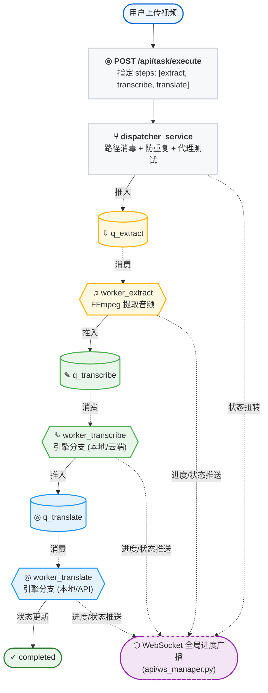

#  架构总览

EchoSRT 采用**单进程异步架构**，以 FastAPI 为 Web 框架，通过 `asyncio.Queue` 驱动三级流水线，前端使用 Vue 3 (基于 CDN 全局引入的零构建方案) 和 Element Plus 构建，通过 WebSocket 全双工通信接收实时进度。

---

## 系统拓扑



---

## 层级职责

| 层级 | 路径 | 职责 |
|------|------|------|
| **路由层** | `api/routers/` | 接收 HTTP 请求，参数校验，调用服务层。新增 `library` 路由处理媒体库操作 |
| **服务层** | `api/services/` | 业务逻辑编排：配置持久化、任务分发、工作区操作、媒体库发现与扫描 |
| **状态层** | `api/state.py` | 全局共享数据结构：三个 `asyncio.Queue` + 多个状态 Dict (任务、下载、媒体发现) |
| **Worker 层** | `api/workers/` | 守护协程，消费队列，驱动 `core/` 引擎 |
| **核心引擎** | `core/` | 纯 Python 模块：FFmpeg、faster-whisper、本地/云端 LLM 翻译引擎、显存互斥调度 |
| **前端** | `frontend/` | 基于 Vue 3 + Element Plus (CDN) 零构建方案，通过 WebSocket 全双工通信 |

---

## 数据流向



---

## 关键设计决策

<details>
<summary><b>1. 混合架构：多进程 + asyncio 协程</b></summary>

EchoSRT 采用 **多进程 (Multiprocessing) + 异步协程 (asyncio)** 的复合架构：

- **I/O 密集操作**：LLM API 调用、WebSocket 通信、配置持久化天生适合 `async/await`，在主进程的事件循环中高效运行。
- **CPU/VRAM 密集操作**：本地 Whisper 推理和本地 llama.cpp 推理运行在**独立子进程**（`multiprocessing.Process`）中。
- **为什么要多进程？**：
    - **隔离 CUDA 上下文**：Linux 默认的 `fork` 会导致父进程显存句柄被错误复制，引发死锁或驱动崩溃。通过 `spawn` 方式启动子进程可彻底规避此问题。
    - **彻底释放显存**：子进程在空闲超时后自动 `sys.exit(0)`，操作系统会强制回收其占用的所有 VRAM 资源。
    - **不阻塞主循环**：重型推理任务不会抢占 Web 服务的事件循环。
</details>

<details>
<summary><b>2. 队列驱动的流水线</b></summary>

三个 `asyncio.Queue` 构成无锁生产者-消费者模型：

```python
# api/state.py
q_extract = asyncio.Queue()      # extract worker → transcribe worker
q_transcribe = asyncio.Queue()   # transcribe worker → translate worker
q_translate = asyncio.Queue()    # translate worker → 完成
```

每个 Worker 是独立的守护协程，通过 `queue.task_done()` 标记完成，支持优雅关闭。
</details>

<details>
<summary><b>3. 基于 Vue 3 的前端无构建方案</b></summary>

EchoSRT 的前端采用 Vue 3 和 Element Plus 构建，通过 CDN 全局引入，实现了原生无构建方案。

好处：极简部署、免安装 Node.js、开箱即用，通过 `app.py` 直接作为静态资源伺服。
</details>

<details>
<summary><b>4. GPU 显存互斥调度</b></summary>

当同时使用本地 Whisper 识别和本地 LLM 翻译时，两者共享同一块 GPU 显存。EchoSRT 通过 `asyncio.Lock` (`gpu_lock`) 实现互斥：

- **识别优先**：翻译任务在获取 `gpu_lock` 前，会主动检查是否有本地 ASR 任务在等待或执行中，如有则静默退让。
- **UNLOAD 指令**：翻译任务获取锁后，向 Whisper 子进程发送 UNLOAD 信号，等待显存释放确认后再加载 LLM 模型。
- **配置开关**：`system_settings.vram_mutual_exclusion` 控制是否启用此机制（默认开启）。

详见 [流水线引擎](流水线引擎)。
</details>

<details>
<summary><b>5. 静态文件服务与前端挂载</b></summary>

`app.py` 中通过 `Mount` 将 `/` 路径挂载到 `frontend/` 目录：

```python
app.mount("/", StaticFiles(directory="frontend", html=True), name="frontend")
```

`html=True` 使 404 请求回退到 `index.html`，支持前端单页应用。
</details>

---

## 启动模式

EchoSRT 通过 `app.py` 启动 FastAPI 服务与后台 Worker 管道，支持多任务并发与 Web UI，共享 `core/` 引擎层。

```
app.py ──启动──▶ 配置 multiprocessing (spawn) ──▶ uvicorn(app, port=8000)
    │
    ├── 1. 初始化 workspace/ 目录
    ├── 2. 加载 config.json（若存在）
    ├── 3. 启动 Worker 守护协程 × 3（后台任务车间）
    └── 4. 开始监听 HTTP 请求
```

详见 [流水线引擎](流水线引擎) 和 [状态管理](状态管理)。
