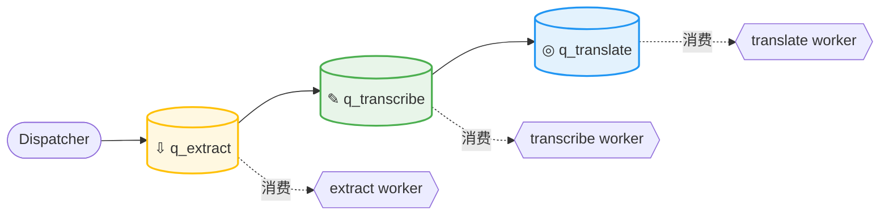
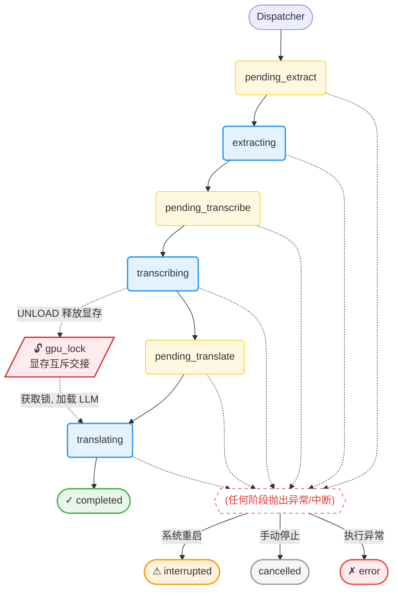

#  流水线引擎

EchoSRT 的任务流水线由三个 `asyncio.Queue` 和三个 Worker 守护协程驱动，实现 **音频提取 → 语音识别 → LLM 翻译** 的自动化串联。

---

## 队列架构



队列定义于 `api/state.py`：

```python
q_extract = asyncio.Queue()
q_transcribe = asyncio.Queue()
q_translate = asyncio.Queue()
```

### 队列数据格式

每个队列元素是一个 `(task_id, config_payload)` 元组：

```python
task_id = "a3f2c9d1"           # 唯一任务标识（也是 workspace 子目录名）
config_payload = {
    "task_id": "a3f2c9d1",
    "steps": ["extract", "transcribe", "translate"],
    "ffmpeg_settings": { ... },
    "transcribe_settings": { ... },
    "model_settings": { ... },
    "vad_settings": { ... },
    "llm_settings": { ... },
    "system_settings": { ... }
}
```

Worker 从队列中取出 `config_payload` 后，按需读取对应的 settings 节。

---

## Worker 生命周期

每个 Worker 是一个 **无限循环的异步守护协程**，在 **`app.py`** 启动时创建（通过 `lifespan` 钩子）：

```python
# app.py
@asynccontextmanager
async def lifespan(app: FastAPI):
    # ...
    asyncio.create_task(worker_extract_loop())
    asyncio.create_task(worker_transcribe_loop())
    asyncio.create_task(worker_translate_loop())
    yield
```

### Worker 通用模板

```python
async def worker_xxx_loop():
    loop = asyncio.get_running_loop()
    while True:
        task_id, config_payload = await q_xxx.get()
        # 1. 更新全局状态
        global_tasks_status[task_id]["current_step"] = "processing"
        try:
            # 2. [防呆] 清理下游旧产物
            # 3. 执行核心逻辑
            # 4. 向下游队列推入
            await manager.send_json({...}, task_id)
        except Exception as e:
            global_tasks_status[task_id]["current_step"] = "error"
            await manager.send_json({"status": "error", ...}, task_id)
        finally:
            q_xxx.task_done()
```

---

## 流水线节点详解

### 第一站：Worker Extract

**文件**：`api/workers/extract.py`  
**核心引擎**：`core/audio_extractor.extract_audio()`

通过 `run_in_executor` 在线程池中执行 FFmpeg，避免阻塞事件循环。

### 第二站：Worker Transcribe

**文件**：`api/workers/transcribe.py`  
**架构：独立子进程模式 (v1.1.1+)**

从 v1.1.1 起，本地 Whisper 推理迁移至独立的 **Worker 子进程**。主进程通过 IPC 队列与子进程通信，实现了 AI 推理与 Web 服务的物理隔离，彻底解决显存卸载导致的闪退问题。

**极致资源回收**：  
子进程空闲 5 分钟后调用 `sys.exit(0)` 自动销毁，操作系统将强制回收所有显存 (VRAM) 资源。主进程会在下次任务到来时自动重新拉起进程。

**引擎分支**：
- **云端 ASR**：通过线程池异步调用 ASR API。
- **本地 Whisper**：将任务投递至子进程 Queue，并在事件循环中轮询子进程返回的进度信号。

### 第三站：Worker Translate

**文件**：`api/workers/translate.py`  
**核心引擎**：`core/translate.run_llm_translation()`

**引擎分支 (v1.3.0+)**：
- **云端 API**：通过 `asyncio.gather` 进行并发分批翻译，支持自定义 **Max Tokens** 和 **Temperature**。
- **本地 LLM**：调用 `core/local_llm_manager.py` 驱动 `llama.cpp` 进行本地推理。请求会被有序下发至本地模型，确保显存占用的可控性。

**GPU 显存互斥调度 (v1.3.0+)**：  
当本地 LLM 翻译与本地 Whisper 识别共用同一 GPU 时，通过 `gpu_lock` (`asyncio.Lock`) 实现互斥：

1. **引擎感知优先调度**：本地 LLM 翻译任务在获取锁前，会扫描 `global_tasks_status` 检查是否有本地 ASR 任务在等待/执行中。如有，翻译任务静默退让（`await asyncio.sleep(1.0)`），确保识别任务优先使用 GPU。
2. **UNLOAD 指令**：翻译任务获取 `gpu_lock` 后，向 Whisper 子进程发送 `("UNLOAD",)` 毒丸，子进程调用 `unload_model()` 释放显存后回传确认。
3. **上下文保护**：本地 LLM 每次翻译开始前调用 `llm_manager.reset_context()` 清空 KV 缓存，避免上一轮残留数据污染新任务。
4. **配置开关**：`system_settings.vram_mutual_exclusion`（默认 `true`）控制是否启用互斥。关闭后两个引擎可并行，但可能导致 OOM。

---

## 状态流流转图



>  **状态说明**:
> - `interrupted`: 任务在执行中遭遇服务器异常重启。系统启动时会扫描 `state.json`，若发现任务处于运行中状态，则自动将其标记为 `interrupted`。
> - `cancelled`: 用户通过前端手动点击“中断”按钮触发的状态。


---

## 配置传递

```python
config_payload = {
    "steps": [...],
    "llm_settings": {
        "api_key": "...",
        "model_name": "...",
        "batch_size": 50,
        "concurrent_workers": 3,
        "max_tokens": 8192,
        "temperature": 1.0
    },
    "system_settings": {
        "vram_mutual_exclusion": true  // GPU 显存互斥开关
    }
}
```
