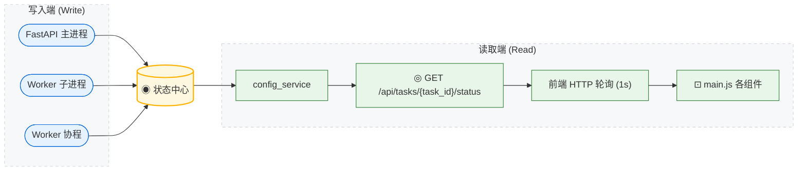
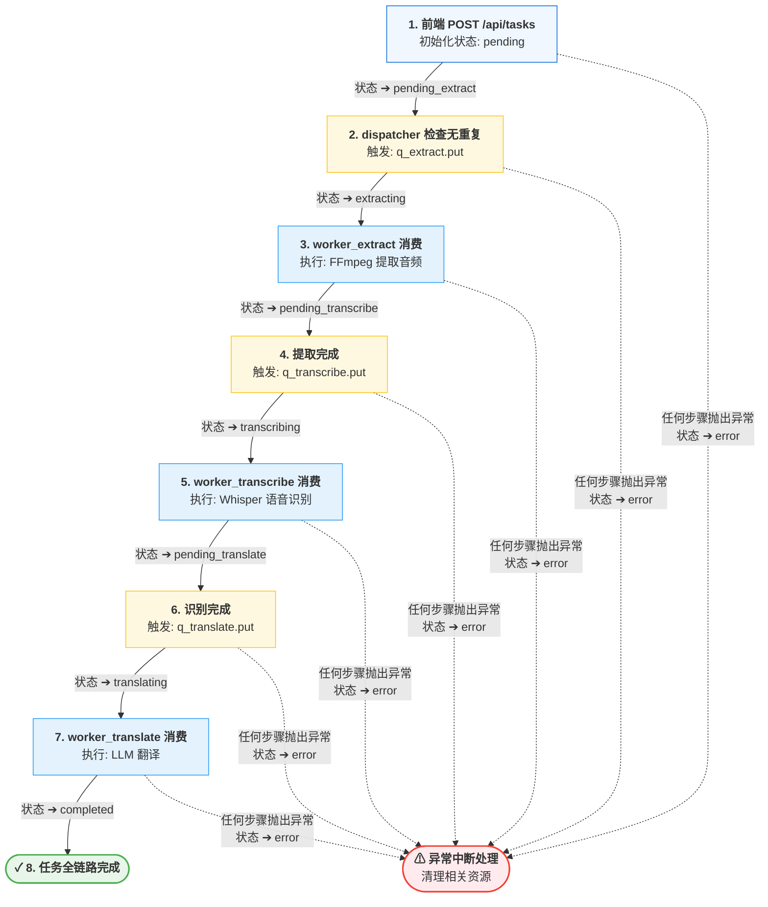

#  状态管理

EchoSRT 使用**全局共享内存字典 + 磁盘持久化**双重机制管理任务和模型状态。

---

## 状态结构定义

所有全局状态集中定义在 `api/state.py`：

```python
import asyncio
from typing import Dict

# ─── 任务队列 (生产者-消费者) ───
q_extract = asyncio.Queue()
q_transcribe = asyncio.Queue()
q_translate = asyncio.Queue()

# ─── 核心字典 (内存与磁盘同步) ───
# global_tasks_status 实时镜像 workspace/{task_id}/state.json 的内容
global_tasks_status: Dict[str, dict] = {}

# ─── 功能字典 (纯内存) ───
# 模型下载状态
global_downloading_models: Dict[str, dict] = {}
# 媒体库扫描发现的文件
global_library_discoveries: Dict[str, dict] = {}
# 任务中断事件句柄
global_cancel_events: Dict[str, asyncio.Event] = {}

# GPU 显存互斥锁 (防止本地 Whisper 与本地 LLM 并发 OOM)
gpu_lock = asyncio.Lock()
```

---

## global_tasks_status 详解

### 数据结构与持久化

v1.2.1 引入了完整的**实时持久化**机制，v1.2.2 进一步增加了**内存回收**：

> **终结态集合** (`TERMINAL_STATES`)：`{"completed", "error", "cancelled"}`。进入这些状态的任务会自动从内存字典中释放，后续查询通过磁盘 `state.json` 回退读取。
1. **读取**：`get_task_status` 被调用时，优先从内存 `global_tasks_status` 读取；若缺失且不属于已删除任务，则从 `workspace/{task_id}/state.json` 自动加载。
2. **写入**：通过 `update_task_status` 发起的修改会同步写入磁盘。若任务进入 `TERMINAL_STATES`，则在写入完成后自动从内存 Dict 中 `pop` 释放资源。
3. **恢复**：`app.py` 启动时自动扫描工作区，仅加载**非终结态**（如 `pending`, `transcribing` 等）的任务到内存，已完成或报错的任务保持“离线”状态。

### current_step 枚举值

| 值 | 含义 | 设置位置 |
|---|------|---------|
| `"pending"` | 已入队，等待处理 | `dispatcher_service.py` |
| `"pending_extract"` | 已推入 q_extract，等待 Worker 消费 | `dispatcher_service.py` |
| `"extracting"` | Worker Extract 正在执行 FFmpeg | `workers/extract.py` |
| `"pending_transcribe"` | 已推入 q_transcribe，等待 Worker 消费 | `workers/extract.py` |
| `"transcribing"` | Worker Transcribe 正在执行语音识别 (子进程) | `workers/transcribe.py` |
| `"downloading"` | 正在从 HuggingFace 下载 Whisper 模型 | `workers/transcribe.py` |
| `"pending_translate"` | 已推入 q_translate，等待 Worker 消费 | `workers/transcribe.py` |
| `"translating"` | Worker Translate 正在执行 LLM 翻译 | `workers/translate.py` |
| `"completed"` | 任务成功完成 (后端已过滤) | 各 Worker |
| `"error"` | 任务执行失败 (后端已过滤) | 各 Worker except 块 |
| `"interrupted"` | 任务在执行中遭遇服务器异常重启 | `app.py` 启动恢复逻辑 |
| `"cancelled"` | 用户通过前端手动点击"中断"按钮触发 | `dispatcher_service.py` |

### 状态读/写路径

v1.1.1 引入了多进程隔离架构，Whisper 推理运行在独立的子进程中。
主进程通过 IPC 队列下发指令，并监听子进程回传的进度信号。



---

## global_downloading_models 详解

用于防止在模型下载期间启动依赖该模型的任务：

```python
# dispatcher_service.py
model_size = payload.get("model_settings", {}).get("model_size", "large-v2")
if model_size in global_downloading_models:
    raise HTTPException(
        status_code=400,
        detail=f"当前选定的模型 [{model_size}] 正在后台下载中，"
               "为防止文件损坏，请等待其下载完成后再启动任务！"
    )
```

模型下载完成后，Worker 从字典中移除对应 key。

---

## WebSocket 状态缓存

`ConnectionManager` 维护了独立的状态缓存，用于 HTTP 轮询回退：

```python
# api/ws_manager.py
class ConnectionManager:
    def __init__(self):
        self.task_states: Dict[str, dict] = {}  # 缓存每个任务的最新 WS 推送

    async def send_json(self, data: dict, task_id: str):
        self.task_states[task_id] = data        # 每次推送时更新缓存
        ...
```

当 WebSocket 连接不可用时，前端通过 HTTP 轮询 `GET /api/tasks/{task_id}/status`，该接口直接返回 `manager.task_states[task_id]`。

---

## 线程安全分析

### 为什么不需要显式锁？

1. **asyncio.Queue** — 内部使用 `asyncio.Lock` 和 `asyncio.Condition`，天然线程安全
2. **global_tasks_status** — 只在协程中读写（单线程事件循环），不存在竞态条件
3. **global_downloading_models** — 同上，仅在协程中操作
4. **ConnectionManager** — 通过 `asyncio.Lock` 保护 WebSocket 多连接并发写入
5. **gpu_lock** — `asyncio.Lock` 保护本地 Whisper 和本地 LLM 的显存互斥。Worker 在获取锁后执行 GPU 密集操作，完成后自动释放

```python
# ws_manager.py — 唯一需要锁的地方
self.locks: Dict[str, asyncio.Lock] = {}

async def send_json(self, data: dict, task_id: str):
    lock = self.locks.get(task_id)
    if lock:
        async with lock:
            for ws in ws_list[:]:
                await ws.send_json(data)
```

---

## 任务生命周期完整示例

### 任务生命周期与状态流转



>  **异常中断处理**: 若以上任何步骤抛出异常，状态立即扭转为 `error` 并清理资源。


与运行时状态不同，用户配置通过 `config_service.py` 持久化到 `config/config.json`：

```python
# api/services/config_service.py
CONFIG_PATH = "config/config.json"
config_lock = asyncio.Lock()  # 文件读写锁

async def get_config() -> dict:
    async with config_lock:
        with open(CONFIG_PATH, "r") as f:
            return json.load(f)

async def update_config(payload: dict):
    async with config_lock:
        # ... 原子写入逻辑 ...
        with open(CONFIG_PATH, "w") as f:
            json.dump(payload, f, indent=2, ensure_ascii=False)
```

### 状态分层对比

| 状态类型 | 存储位置 | 生命周期 | 持久化 |
|---------|---------|---------|--------|
| 任务状态 | `global_tasks_status` (内存 + state.json) | 永久 |  自动保存/恢复 |
| WS 缓存 | `manager.task_states` (内存 Dict) | 进程生命周期 |  |
| 媒体库发现 | `global_library_discoveries` (内存 Dict) | 进程生命周期 |  (随扫描更新) |
| 模型下载 | `global_downloading_models` (内存 Dict) | 当前下载会话 |  |
| 用户配置 | `config/config.json` | 永久 |  文件持久化 |
| 任务产物 | `workspace/{task_id}/` | 手动清理 |  文件系统 |

---

## 最佳实践

<details>
<summary><b>1. 不直接修改全局字典</b></summary>

所有对 `global_tasks_status` 的修改应通过确定的状态转换路径，避免出现非枚举值或脏数据。Worker 总是在进入 try 块时同步更新 `current_step`。

```python
#  正确
global_tasks_status[task_id]["current_step"] = "extracting"

#  避免
global_tasks_status[task_id]["custom_field"] = random_value
```
</details>

<details>
<summary><b>2. 队列元素不可变</b></summary>

队列传递的是 `(task_id, config_payload)` 元组引用。Worker 消费后不应修改 `config_payload` 的内容（如需修改，应 `copy.deepcopy`）。
</details>

<details>
<summary><b>3. 错误状态不可恢复</b></summary>

一旦 `current_step` 变为 `"error"`，该任务不再被任何 Worker 处理。若需重试，应重新 POST 新的任务（生成新的 task_id）。
</details>
