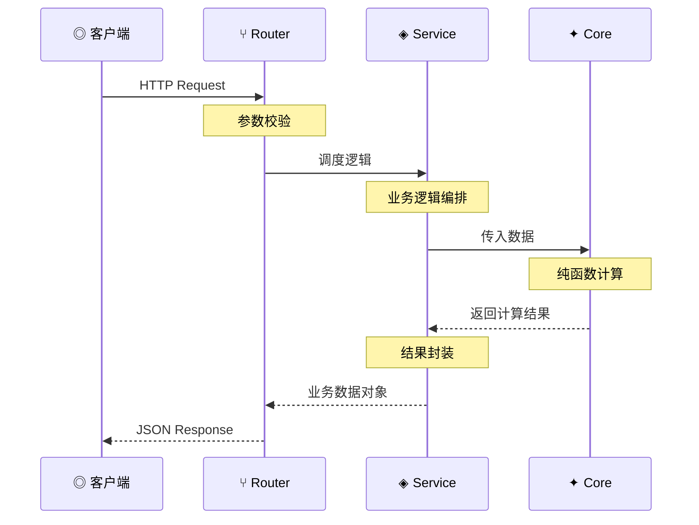
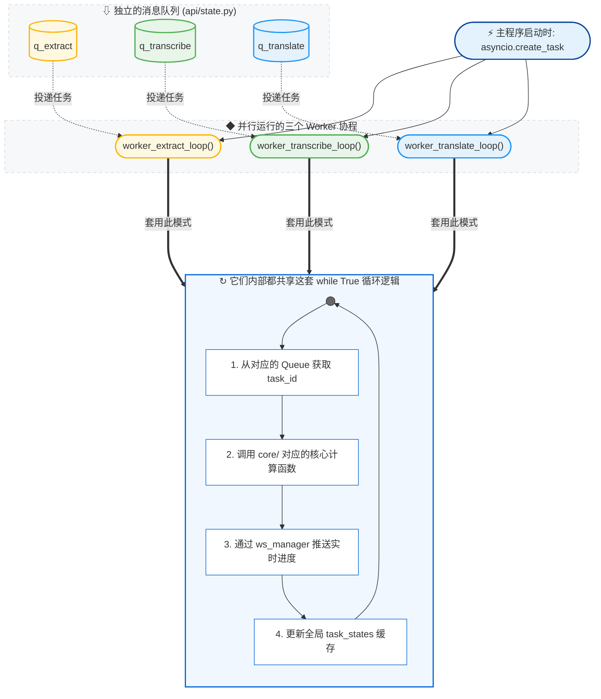
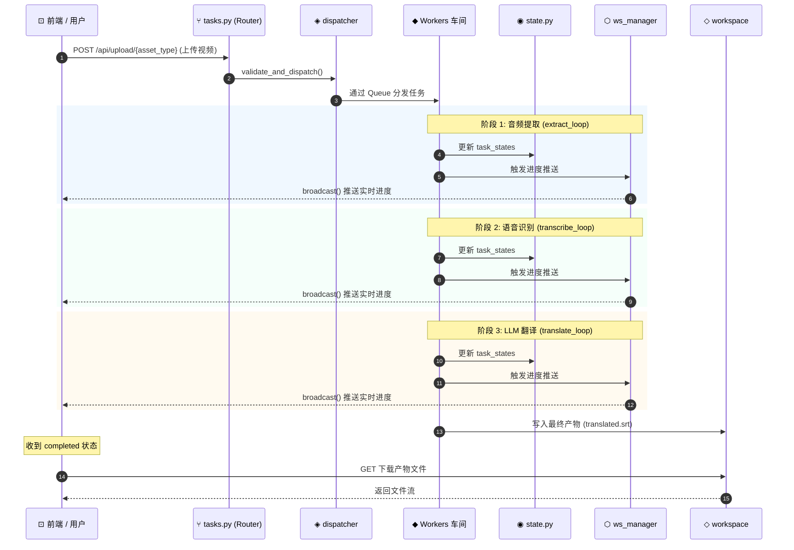

#  项目结构

本页详细阐述 EchoSRT 的代码组织结构，帮助开发者快速定位和修改代码。

---

## 目录总览

```
EchoSRT/
├── app.py                          # FastAPI 应用入口（API 服务模式 + 后台 Worker 协程）
├── docker-compose.yml              # Docker Compose 编排文件
├── Dockerfile                      # CPU 版本镜像构建文件
├── Dockerfile.gpu                  # GPU 版本镜像构建文件
├── docker-entrypoint.sh            # 容器启动脚本（PUID/PGID 处理）
├── requirements.txt                # Python 依赖清单
├── README.md                       # 项目说明
│
├── core/                           #  核心处理引擎（无状态纯函数）
│   ├── __init__.py
│   ├── audio_extractor.py          # FFmpeg 音频提取
│   ├── whisper_engine.py           # faster-whisper 本地引擎封装
│   ├── api_transcribe.py           # 在线 ASR API 适配层
│   ├── srt_formatter.py            # SRT 字幕格式化与生成
│   ├── translate.py                # LLM 翻译引擎封装
│   ├── local_llm_manager.py        # 本地 LLM 推理管理器 (llama-cpp-python)
│   └── llm_engine.py               # 本地 LLM 子进程循环 (llama-cpp-python)
│
├── api/                            #  Web API 层
│   ├── __init__.py
│   ├── state.py                    # 全局任务状态管理器
│   ├── ws_manager.py               # WebSocket 连接管理器
│   ├── routers/                    # FastAPI 路由定义
│   │   ├── __init__.py
│   │   ├── config.py               # 配置读写 API
│   │   ├── tasks.py                # 任务提交与查询 API
│   │   ├── library.py              # 媒体库扫描与导入 API
│   │   └── ws.py                   # WebSocket 端点
│   ├── services/                   # 业务逻辑层
│   │   ├── __init__.py
│   │   ├── config_service.py       # 配置读写 + 代理设置
│   │   ├── dispatcher_service.py   # 任务派发与参数验证
│   │   ├── workspace_service.py    # 工作区文件管理
│   │   └── library_service.py      # 媒体库扫描引擎
│   └── workers/                    # 后台任务车间（异步循环）
│       ├── __init__.py
│       ├── extract.py              # 音频提取 Worker
│       ├── transcribe.py           # 语音识别 Worker
│       └── translate.py            # 翻译 Worker
│
├── frontend/                       #  纯静态前端 (Vanilla JS)
│   ├── index.html                  # SPA 主入口
│   ├── favicon.png / logo.png      # 图标资源
│   ├── css/style.css               # 全局样式
│   └── js/
│       ├── api.js                  # HTTP API 封装
│       ├── store.js                # 全局响应式状态管理
│       ├── main.js                 # SPA 路由与初始化
│       └── components/             # 功能组件
│           ├── GlobalSettings.js   # 全局设置面板
│           ├── GlobalConsole.js    # 实时日志控制台
│           ├── TabWorkspace.js     # 工作区管理标签页
│           ├── TabAudio.js         # 音频提取标签页
│           ├── TabWhisper.js       # Whisper 配置标签页
│           ├── WhisperLocal.js     # 本地引擎运行面板
│           ├── WhisperApi.js       # 云端 API 运行面板
│           └── TabLLM.js           # LLM 翻译标签页
│
├── config/                         #  配置文件
│   ├── config.example.json         # 配置模板（带注释说明）
│   └── config.json                 # 运行时配置（用户自定义，.gitignore）
│
└── workspace/                      #  任务产物（运行时生成，.gitignore）
    └── {task_id}/                  # 每个任务独立子目录
        ├── meta.json               # 任务元信息
        ├── state.json              # 流水线状态持久化
        ├── video.*                 # 上传的原始视频
        ├── audio.wav               # 提取的音频
        ├── original.srt            # 原始字幕
        └── translated.srt          # 翻译后字幕
```

---

## 核心层 (`core/`) 设计原则

| 原则 | 说明 |
|------|------|
| **无状态** | 所有函数为纯函数，不持有全局状态，不依赖具体框架 |
| **可复用** | 可被 API 模式和 CLI 模式共同调用 |
| **弱耦合** | 仅依赖 Python 标准库 + 第三方模型库 |

### `core/audio_extractor.py`

- 通过 `subprocess` 调用 FFmpeg 命令行
- 接受 `ffmpeg_settings` 自定义参数（音频流选择、时间范围等）
- 输出 16kHz/mono PCM WAV 文件供下游处理

### `core/whisper_engine.py`

- 封装 `faster-whisper` 库
- 支持模型按需下载到 `download_root` 配置的目录（默认 `models/`）
- 集成 VAD（语音活动检测）裁剪静音段
- 自定义回调 `progress_callback` 推送实时进度
- 返回 `List[Segment]` 结构化数据

### `core/api_transcribe.py`

- 封装在线 ASR 服务调用（如 OpenAI Whisper API）
- 自动分块上传长音频（避免请求体过大）
- 合并多段结果并转写为统一 Segment 格式

### `core/translate.py`

- 封装 LLM API 调用（OpenAI / DeepSeek 兼容格式）
- 支持 `concurrent_workers` 并发批次翻译（`asyncio.Semaphore`）
- 排版熔断：保留原始 SRT 格式不破坏字幕索引
- 异步架构：`AsyncOpenAI` + `httpx`
- 双引擎支持：云端 API 模式和本地 llama.cpp 模式平滑切换

### `core/local_llm_manager.py`

- 单例模式管理本地 LLM 推理（`llama-cpp-python`）
- 自动加载/卸载 GGUF 模型，支持 GPU 层数和上下文窗口配置
- 空闲超时自动释放显存（默认 300 秒）
- 线程安全推理锁 + 异步加载锁，防止并发崩溃
- 与 Whisper 子进程通过 `gpu_lock` 实现显存互斥

---

## API 层 (`api/`) 设计原则

| 原则 | 说明 |
|------|------|
| **关注点分离** | Router → Service → Core 三层架构 |
| **异步优先** | 所有 I/O 操作使用 `async/await` |
| **懒加载 Worker** | Worker 循环在 `lifespan` 事件中启动，优雅关闭 |

### 请求生命周期



### Worker 工作模式



---

## 前端架构

### 设计理念

- **零构建工具**：纯 Vanilla JS，无 npm / webpack / vite
- **SPA 路由**：基于 `window.location.hash` 的简单路由（`main.js`）
- **响应式状态**：`store.js` 实现发布-订阅模式，`api.js` 封装 fetch

### 组件树

```
index.html
├── GlobalSettings      (全局配置侧边栏)
├── GlobalConsole       (底部实时日志)
└── 标签页路由 (/main.js)
    ├── TabWorkspace    (#workspace)
    ├── TabAudio        (#audio)
    ├── TabWhisper      (#whisper)
    │   ├── WhisperLocal  (本地引擎子面板)
    │   └── WhisperApi    (云端 API 子面板)
    └── TabLLM          (#llm)
```

---

## 数据流





---

## 相关文档

- [开发贡献指南](开发贡献指南) — 如何参与项目开发
- [架构概览](架构总览) — 系统顶层设计