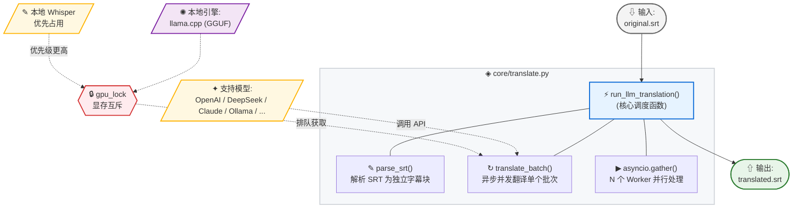

#  LLM 翻译

EchoSRT 集成 LLM（大语言模型）实现字幕翻译，支持**云端 API** 与**本地离线**双引擎。可将 `original.srt` 翻译为目标语言并输出 `translated.srt`。翻译引擎支持异步并发批量处理，在保持字幕时间轴完整的前提下高效翻译长视频字幕。

---

## 翻译架构

---

## 翻译流程详解

### 第一阶段：SRT 解析

每个元素是一个完整的 SRT 块（序号 + 时间轴 + 文本）。系统会自动处理换行符并清洗 DeepSeek R1 等模型的思考标签。

### 第二阶段：分批与上下文注入

系统会将字幕分批发送给大模型，并自动注入上一批的结尾作为上下文参考，以确保翻译的连贯性。

### 第三阶段：异步并发翻译

通过 `Semaphore` 严格控制并发数，防止触发 API 限流。对于本地模型，翻译请求会被有序下发至本地推理引擎。

---

## 翻译引擎选择 (v1.3.0)

EchoSRT 支持两种翻译模式，可在"翻译设置"面板顶部的 **引擎类型** 中切换：

| 引擎 | 说明 | 详细文档 |
|------|------|---------|
|  **API 模式** | OpenAI 兼容的云端翻译，支持任意 `/v1/chat/completions` 端点 | [云端 API 翻译](API翻译) |
|  **本地模式** | `llama.cpp` 驱动 GGUF 量化模型，完全离线、零费用 | [本地 LLM 翻译](本地LLM翻译) |

> **GPU 显存互斥**：当同时使用本地 Whisper 和本地 LLM 时，`gpu_lock` 确保两者串行使用 GPU，防止 OOM。详见 [本地 LLM 翻译 → GPU 显存互斥机制](本地LLM翻译#gpu-显存互斥机制-v130)。

---

## 最佳实践

1. **翻译质量**：优先选择强模型（如 DeepSeek-V3），批次大小设为 50 左右
2. **翻译速度**：对于低延迟服务（如 Groq），可适当增加并发数至 5-8
3. **格式修复**：如果发现模型输出了多余的 Markdown 代码块，系统会自动进行清洗
4. **多方案备份**：预设多套 API 方案，遇到限流或故障时一键切换
5. **本地优先**：敏感内容或高频翻译场景建议使用本地引擎，零隐私风险

---

## 故障排除

| 错误 | 常见原因 | 解决方向 |
|------|---------|---------|
| **429** | API 限流 | 减小并发请求数 |
| **401** | API Key 无效或过期 | 检查密钥配置 |
| **500** | 服务商端异常 | 切换至备用方案 |
| **OOM** | 显存溢出 | 切换更小模型或降低 `n_gpu_layers` |

详细故障排除见各引擎专属文档。

---

## 相关文档

- [云端 API 翻译](API翻译) — API 模式参数、服务商、多方案管理
- [本地 LLM 翻译](本地LLM翻译) — GGUF 模型推理、GPU 显存互斥、子进程架构
- [配置详解](配置详解) — `llm_settings` 完整参数参考
- [结果下载与文件管理](结果下载与文件管理) — 翻译后 SRT 产物下载
