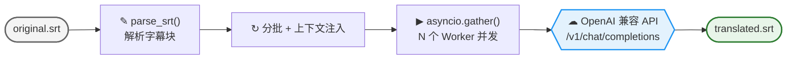

#  云端 API 翻译

EchoSRT 支持通过 OpenAI 兼容的 Chat Completions API 进行字幕翻译。您可以预设多套不同的 API 方案，适配不同的服务商或网络环境。翻译引擎基于 `asyncio.Semaphore` 实现并发批量处理，在保证字幕时间轴完整的前提下高效完成翻译。

---

## 翻译流程



1. **SRT 解析**：将原始字幕拆分为独立的字幕块，清洗 DeepSeek R1 等模型的思考标签
2. **分批与上下文注入**：按 `batch_size` 分批，自动注入上一批结尾作为上下文参考，确保翻译连贯性
3. **异步并发翻译**：通过 `asyncio.Semaphore` 控制并发数，`asyncio.gather` 并行提交

---

## 配置参数

在 **LLM 翻译** 标签页中，引擎类型选择 **API 模式**：

### 核心参数

| 参数 | 默认值 | 说明 |
|------|--------|------|
| `api_key` | `""` | 您的 API 访问密钥。 |
| `base_url` | `https://api.openai.com/v1` | 兼容 OpenAI 格式的接口地址。 |
| `model_name` | `"gpt-4o"` | 模型名称，支持点击刷新图标自动拉取可用模型列表。 |

### 并发与批次

| 参数 | 默认值 | 说明 |
|------|--------|------|
| `batch_size` | `50` | 每批发送的字幕条数。值越大单次翻译量越多，但可能超出模型上下文窗口。 |
| `concurrent_workers` | `3` | 并发 Worker 数。越大越快但可能触发 API 限流 (429)。 |

### 高级参数

| 参数 | 默认值 | 说明 |
|------|--------|------|
| `max_tokens` | `8192` | 单次响应的最大 Token 数。长文本批量翻译建议调大。 |
| `temperature` | `1.0` | 生成温度系数。`0.0` 为确定性输出，`1.0` 为最大随机性。 |
| `system_prompt` | (内置默认) | 自定义系统提示词。覆盖默认的翻译风格指令。 |

### 超时配置

| 参数 | 默认值 | 下限 | 说明 |
|------|--------|------|------|
| `connect` | `15.0` | 3.0 秒 | TCP 握手超时 |
| `read` | `300.0` | 30.0 秒 | 等待 API 响应的超时。大批次翻译建议调大。 |
| `write` | `20.0` | — | 发送请求体超时 |
| `pool` | `10.0` | — | 连接池获取超时 |

---

## 多方案管理

通过方案选择器右侧的 **设置** 按钮，可以执行以下操作：

- **新增方案**：克隆当前配置创建备用方案
- **重命名**：为方案取直观的名字（如 "生产环境"、"备用线路"）
- **删除**：移除不再使用的配置
- **一键切换**：在任务执行前从下拉框快速切换激活的方案

---

## 兼容服务商

任何实现 `/v1/chat/completions` 端点的服务均可接入，只需修改 `base_url` 和 `api_key`：

| 服务商 | base_url | 备注 |
|--------|----------|------|
| **OpenAI** | `https://api.openai.com/v1` | 官方服务 |
| **DeepSeek** | `https://api.deepseek.com/v1` | 高性价比，支持 R1 推理 |
| **SiliconFlow** | `https://api.siliconflow.cn/v1` | 国内高速访问 |
| **Groq** | `https://api.groq.com/openai/v1` | 超低延迟 |
| **OpenRouter** | `https://openrouter.ai/api/v1` | 聚合多家模型 |
| **本地 Ollama** | `http://localhost:11434/v1` | 完全离线 |

---

## 代理配置

当全局代理启用且 `llm_settings.use_network_proxy = true` 时，翻译 API 请求会通过配置的 HTTP/SOCKS5 代理：

```python
if actual_use_proxy:
    client_params["http_client"] = httpx.AsyncClient(proxy=proxy_url, timeout=timeout_config)
else:
    client_params["http_client"] = httpx.AsyncClient(proxy=None, trust_env=False, timeout=timeout_config)
```

`trust_env=False` 确保非代理模式不会意外通过系统环境变量连接。

---

## 最佳实践

1. **翻译质量优先**：选择强模型（如 DeepSeek-V3、GPT-4o），`batch_size` 设为 50 左右
2. **翻译速度优先**：对于低延迟服务（如 Groq），适当增加 `concurrent_workers` 至 5-8
3. **格式修复**：系统自动清洗模型输出的 Markdown 代码块和思考标签 (`<think>`)
4. **时间轴保护**：翻译后自动对齐原始 SRT 时间轴，防格式雪崩

---

## 故障排除

| 错误 | 原因 | 解决 |
|------|------|------|
| **429 Too Many Requests** | 触发 API 限流 | 减小 `concurrent_workers`，或切换到更高配额的方案 |
| **401 Unauthorized** | API Key 无效或过期 | 检查 Key 是否正确填写，确认账户余额充足 |
| **500 Internal Server Error** | 服务商端异常 | 切换至备用方案，或稍后重试 |
| **上下文超长** | 翻译文本超出模型窗口 | 调低 `batch_size`，或调大 `max_tokens` |
| **返回空内容** | 模型安全拦截或输出异常 | 检查 `system_prompt` 是否触发审核，尝试简化提示词 |

---

## 相关文档

- [本地 LLM 翻译](本地LLM翻译) — 离线 GGUF 模型推理
- [LLM 翻译总览](LLM翻译) — 双引擎架构与通用流程
- [配置详解](配置详解) — `llm_settings` 完整参数参考
