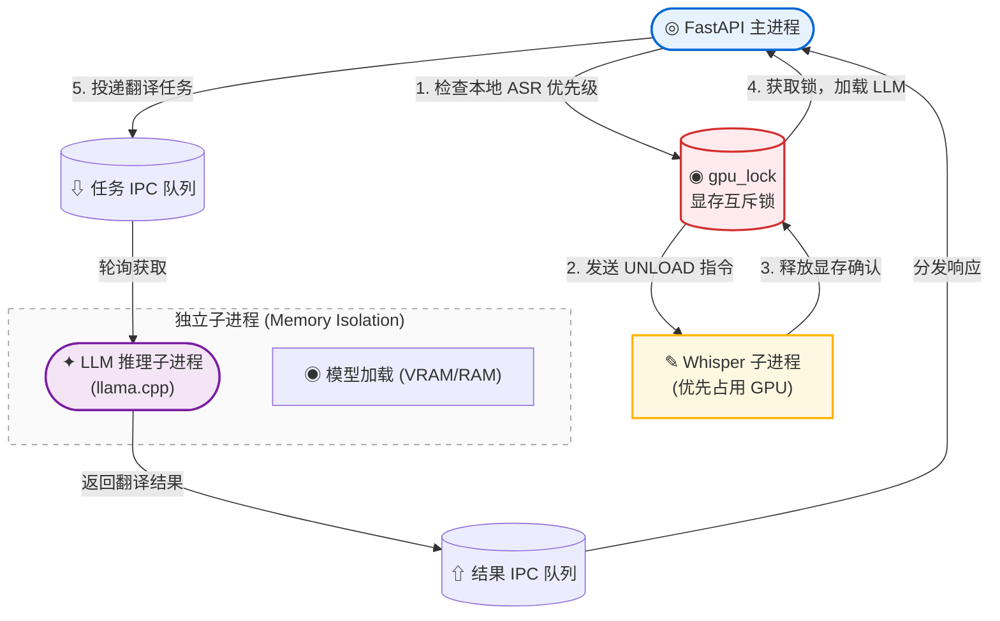
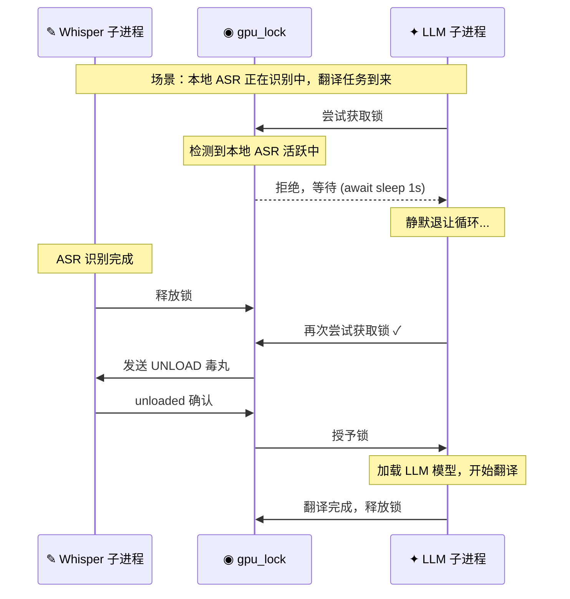

#  本地 LLM 翻译

EchoSRT 支持通过 `llama-cpp-python` 驱动本地 GGUF 量化模型进行完全离线的字幕翻译。无需网络连接，数据不出本机，提供更佳的隐私保护与零成本方案。本地引擎运行在独立子进程中，与 Web 主进程物理隔离。

---

## 架构概览



---

## 配置参数

在 **LLM 翻译** 标签页中，引擎类型切换为 **本地离线引擎**：

| 参数 | 默认值 | 说明 |
|------|--------|------|
| `model_path` | `""` | GGUF 模型文件的绝对路径或相对于项目根目录的路径（如 `models/llm/qwen2.5-7b-instruct-q4_k_m.gguf`）。 |
| `n_gpu_layers` | `-1` | 卸载到 GPU 的层数。`-1` 表示全部卸载（推荐），`0` 表示纯 CPU 推理。 |
| `n_ctx` | `4096` | 上下文窗口大小。建议保持与模型默认值一致。 |
| `idle_timeout` | `300` | 模型空闲卸载时间（秒）。超时后自动释放显存/内存。 |

### 并发控制

本地引擎强制 `concurrent_workers = 1`，防止并行推理导致显存溢出。翻译请求会被**有序排队**下发至本地模型，确保显存占用的可控性。

### max_tokens 自动下调

如果配置的 `max_tokens` 大于模型的 `n_ctx`，系统自动下调以防立即崩溃：

```
max_tokens = n_ctx - 512  (最小保证 512)
```

---

## GPU 显存互斥机制 (v1.3.0)

当同时使用**本地 Whisper 识别**和**本地 LLM 翻译**时，两者共享同一块 GPU 显存。EchoSRT 通过 `gpu_lock` (`asyncio.Lock`) 实现互斥调度：



### 四层保护机制

| 层级 | 机制 | 说明 |
|------|------|------|
| 1. **识别优先调度** | 引擎感知扫描 | 翻译任务获取锁前，扫描 `global_tasks_status` 检测是否有本地 ASR 任务在等待/执行中，如有则静默退让 (`await asyncio.sleep(1.0)`) |
| 2. **UNLOAD 指令** | 显存交接 | 翻译任务获取 `gpu_lock` 后，向 Whisper 子进程发送 `("UNLOAD",)` 毒丸，子进程调用 `unload_model()` + `gc.collect()` + `torch.cuda.empty_cache()` 彻底释放显存 |
| 3. **上下文保护** | KV Cache 清空 | 每次新翻译开始前调用 `llm_manager.reset_context()`，向子进程发送 `("RESET",)` 指令调用 `model.reset()`，避免上一轮残留数据污染新任务 |
| 4. **配置开关** | `vram_mutual_exclusion` | 在"全局设置"中控制是否启用。默认 `true`。关闭后两个引擎可并行，但可能导致 OOM |

---

## 模型获取

### 推荐 GGUF 模型

将 `.gguf` 模型文件放入 `models/llm/` 目录，前端下拉框会自动识别。推荐模型：

| 模型 | 参数量 | 显存占用 | 说明 |
|------|--------|---------|------|
| Qwen2.5-7B-Instruct | 7B | ~6 GB (Q4) | 中文翻译首选 |
| Qwen2.5-14B-Instruct | 14B | ~10 GB (Q4) | 更高质量 |
| DeepSeek-R1-Distill-Qwen-7B | 7B | ~6 GB (Q4) | 推理能力强 |
| Llama-3-8B-Instruct | 8B | ~6 GB (Q4) | 通用多语言 |

> 从 [HuggingFace](https://huggingface.co/models?library=gguf) 搜索 GGUF 格式模型，或使用国内镜像站下载。

---

## 子进程生命周期

LLM 推理运行在独立的 `multiprocessing.Process` 中：

```python
# core/local_llm_manager.py
class LocalLLMManager:
    def ensure_llm_worker_running(self):
        if self.llm_process is None or not self.llm_process.is_alive():
            self.llm_process = Process(target=llm_worker_process_loop, daemon=True)
            self.llm_process.start()
```

- **懒加载**：首次翻译请求到达时才启动子进程
- **空闲自毁**：`idle_timeout + 60` 秒无任务后自动 `sys.exit(0)`，释放全部显存
- **崩溃隔离**：子进程崩溃不影响 Web 主服务，下次请求自动重新拉起

---

## 性能参考

以 Qwen2.5-7B-Instruct Q4_K_M 模型，RTX 3060 12GB 环境为例：

| 批次 | 字幕条数 | 耗时 |
|------|---------|------|
| 10 条/批 | 240 条 | ~2 分钟 |
| 30 条/批 | 240 条 | ~1 分钟 |
| 50 条/批 | 240 条 | ~45 秒 |

> 实际速度受 GPU 显存带宽、上下文窗口大小、字幕文本长度等因素影响。

---

## 故障排除

| 问题 | 原因 | 解决 |
|------|------|------|
| **CUDA Out of Memory** | 显存不足 | 减小 `n_gpu_layers` 或使用更小的 GGUF 模型（Q2/Q3 量化） |
| **翻译结果截断** | 上下文窗口不够 | 调大 `n_ctx`，或减小 `batch_size` |
| **未安装 llama-cpp-python** | 缺少依赖 | `pip install llama-cpp-python --extra-index-url https://abetlen.github.io/llama-cpp-python/whl/cu122` |
| **找不到模型文件** | 路径配置错误 | 确认 `model_path` 指向存在的 `.gguf` 文件 |
| **子进程无响应** | 模型加载卡住 | 检查模型文件完整性，尝试重新下载 |
| **GPU 显存互斥卡死** | Whisper 未释放 | 检查 `vram_mutual_exclusion` 配置；临时关闭后手动重试 |

---

## 相关文档

- [云端 API 翻译](API翻译) — OpenAI 兼容接口翻译
- [LLM 翻译总览](LLM翻译) — 双引擎架构与通用流程
- [本地 Whisper 识别](本地Whisper识别) — GPU 显存互斥的另一端
- [配置详解](配置详解) — `llm_settings.local_settings` 完整参数参考
