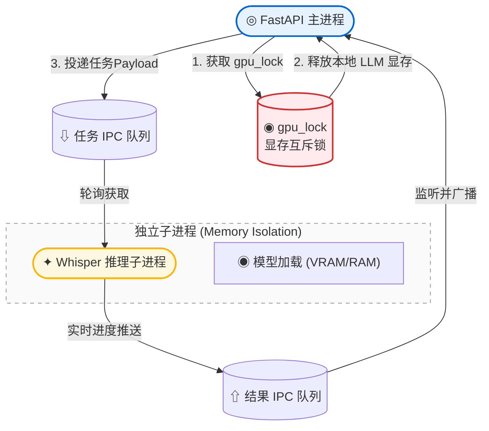

#  本地 Whisper 识别

EchoSRT 集成了 [faster-whisper](https://github.com/Systran/faster-whisper) 作为本地离线语音识别引擎。faster-whisper 基于 CTranslate2 重新实现了 OpenAI Whisper 模型，在保持相同精度的前提下速度提升 **4 倍**，内存使用减少 **50%**。

---

## 架构概览 (v1.1.1+ 物理隔离)

从 v1.1.1 起，EchoSRT 引入了**独立子进程推理架构**。Whisper 推理不再运行在 Web 主进程中，而是通过 `multiprocessing` 运行在隔离的子进程中。



## 模型生命周期与显存管理

### 独立进程隔离

这种架构彻底解决了 AI 推理中常见的几个痛点：
1. **彻底的显存释放**：Python 的垃圾回收（GC）有时无法完全释放 C 扩展占用的显存。通过销毁整个子进程，操作系统可以强制回收所有 VRAM 资源。
2. **5 分钟自动销毁机制**：子进程在空闲 5 分钟后会自动执行 `sys.exit(0)` 退出。主进程在下一次任务到来时会自动拉起新进程。
3. **主进程稳定性**：即使推理引擎发生 Segmentation Fault（段错误）或 OOM（内存溢出），只会导致子进程崩溃，Web UI 依然能正常响应并报告错误。

### 加载逻辑

```python
# api/workers/transcribe.py
def ensure_worker_running():
    global whisper_process, whisper_task_queue, whisper_result_queue
    if whisper_process is None or not whisper_process.is_alive():
        whisper_process = Process(target=worker_process_loop, ...)
        whisper_process.start()
```

加载时，子进程会检查 `_cached_model_params`，只有当模型尺寸或设备参数改变时才会重新加载权重文件。

### 设备自动检测

```python
if shutil.which("nvidia-smi"):
    device = "cuda"
    compute_type = "float16"   # GPU: FP16 推理
else:
    device = "cpu"
    compute_type = "int8"      # CPU: INT8 量化推理
```

| 环境 | 设备 | 计算精度 | 说明 |
|------|------|----------|------|
| NVIDIA GPU 可用 | `cuda` | `float16` | 完整精度，~6GB 显存 (large-v2) |
| CPU Only | `cpu` | `int8` | 量化推理，内存需求减半，速度较慢 |

### 模型卸载

当手动删除模型或切换模型时，系统会调用 `unload_model()` 释放显存：

```python
def unload_model():
    global _cached_model, _cached_model_params
    if _cached_model is not None:
        del _cached_model
        _cached_model = None
        _cached_model_params = None
        gc.collect()
        print("[*] Whisper 模型已从显存中卸载。")
```

## 模型下载机制

### 自动预下载

在加载模型前，`whisper_engine.py` 会先调用 `huggingface_hub.snapshot_download()` 确保模型文件存在于本地：

```python
repo_id = _MODELS.get(model_size, model_size)  # 例如 "Systran/faster-whisper-large-v2"
snapshot_download(repo_id=repo_id, cache_dir=custom_model_dir, proxies=proxies)
```

下载目录结构：

```
models/
└── models--Systran--faster-whisper-large-v2/
    ├── blobs/        # 模型权重二进制文件
    ├── refs/         # Git 引用
    └── snapshots/
        └── {hash}/
            ├── model.bin       # CTranslate2 格式的模型权重
            ├── config.json     # 模型配置
            ├── tokenizer.json  # 分词器
            └── vocabulary.txt  # 词表
```

### 代理下载

当全局代理启用且 `use_proxy_for_model_download = true` 时，下载请求会通过配置的代理服务器：

```python
proxies = {"http": _dl_proxy, "https": _dl_proxy} if actual_use_proxy else {"http": None, "https": None}
snapshot_download(repo_id=repo_id, cache_dir=custom_model_dir, proxies=proxies)
```

SOCKS5 代理会自动转换为 SOCKS5h（远程 DNS 解析），防止本地 DNS 污染阻断 Hugging Face 访问。

### 手动下载模型

在前端全局设置 → Whisper 模型面板中，可以手动触发指定模型的下载。下载进度通过 WebSocket 实时推送：

```json
{
  "status": "processing",
  "step": "downloading",
  "model_id": "large-v2",
  "downloaded_mb": 128.5
}
```

### 损坏模型自动清理

如果模型文件不完整或损坏导致加载失败，系统会自动删除损坏的缓存目录并抛出明确错误：

```python
except Exception as e:
    corrupted_folder = os.path.join(custom_model_dir, f"models--{repo_id.replace('/', '--')}")
    if os.path.exists(corrupted_folder):
        shutil.rmtree(corrupted_folder)
    raise RuntimeError(f"模型文件损坏或加载失败，已自动清理缓存...")
```

## 识别参数全览

所有 `transcribe_settings` 中的参数（除 `engine` 外）直接透传给 `WhisperModel.transcribe()`：

```python
transcribe_kwargs = transcribe_settings.copy()
transcribe_kwargs.pop("engine", None)

segments, info = _cached_model.transcribe(
    audio_path,
    **transcribe_kwargs,
    **vad_settings
)
```

完整参数说明见 [配置详解 → transcribe_settings](配置详解#4-transcribe_settings--本地识别参数)。

### 常用场景参数组合

<details>
<summary>场景一：英文视频字幕 (最高精度)</summary>

```json
{
  "model_size": "large-v2",
  "language": "en",
  "beam_size": 10,
  "best_of": 10,
  "word_timestamps": true,
  "vad_filter": true,
  "compression_ratio_threshold": 1.8,
  "log_prob_threshold": -0.5
}
```
</details>

<details>
<summary>场景二：多语言视频 (自动检测)</summary>

```json
{
  "model_size": "large-v2",
  "language": null,
  "beam_size": 5,
  "vad_filter": true,
  "condition_on_previous_text": true
}
```
</details>

<details>
<summary>场景三：快速预览 (牺牲少量精度)</summary>

```json
{
  "model_size": "distil-large-v2",
  "beam_size": 1,
  "best_of": 1,
  "condition_on_previous_text": false,
  "compression_ratio_threshold": 3.0
}
```
</details>

### 返回结果

`transcribe()` 返回两个值：
- `segments` — 生成器，逐段 yield `Segment` 对象（包含 `start`, `end`, `text` 等字段）
- `info` — `TranscriptionInfo` 对象（包含 `language`, `language_probability`, `duration` 等）

## VAD 语音活动检测

VAD（Voice Activity Detection）通过 Silero VAD 模型检测音频中的语音段，过滤静音和噪音，减少 Whisper 在空白段的幻觉输出。

启用方式：

```json
{
  "vad_settings": {
    "vad_filter": true
  }
}
```

当 `vad_filter = true` 时，`vad_settings` 字典会作为关键字参数直接传入 `WhisperModel.transcribe()`，faster-whisper 内部自动处理 VAD 分割。

## 性能参考

以下是处理 1 小时 16kHz/mono WAV 音频的典型性能数据：

| 模型 | GPU (RTX 4090) | CPU (Apple M2) | CPU (Intel i7-13700K) |
|------|---------------|----------------|----------------------|
| `tiny` | ~1 分钟 | ~4 分钟 | ~6 分钟 |
| `small` | ~2 分钟 | ~11 分钟 | ~18 分钟 |
| `medium` | ~4 分钟 | ~22 分钟 | ~35 分钟 |
| `large-v2` | ~7 分钟 | ~40 分钟 | ~60 分钟 |
| `distil-large-v2` | ~2.5 分钟 | ~15 分钟 | ~25 分钟 |

>  **注**：以上数据为估算值，实际速度受 CPU 核心数、磁盘 I/O、音频复杂度等多因素影响。

## 故障排除

<details>
<summary>Q: 识别结果全是空白或乱码？</summary>

1. 确认音频采样率是否为 16kHz / mono
2. 尝试将 `language` 从 `null`（自动检测）改为手动指定
3. 降低 `compression_ratio_threshold` 和 `no_speech_threshold`
4. 确保 VAD 已启用
</details>

<details>
<summary>Q: CUDA Out of Memory？</summary>

1. 切换到更小的模型（如 `small` 或 `medium`）
2. 在 CPU 模式下运行（自动使用 INT8 量化）
3. 关闭其他占用显存的程序
</details>

<details>
<summary>Q: CPU 推理太慢？</summary>

1. 使用蒸馏模型 `distil-large-v2`（速度提升 3×）
2. 关闭 `condition_on_previous_text` 提升并行度
3. 降低 `beam_size` 和 `best_of`
4. 考虑使用云端 API 方案（见下一节）
</details>
